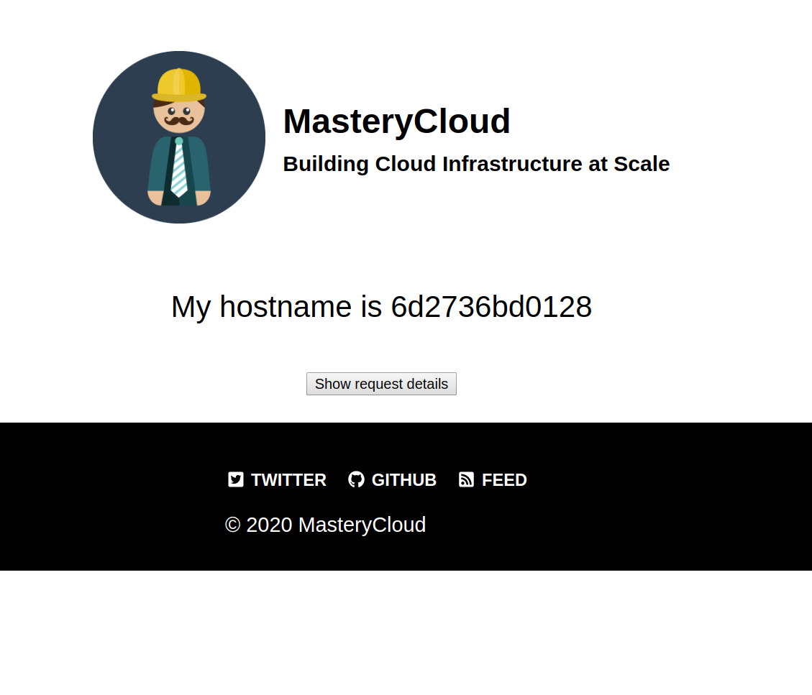

# hello-world

## About this image

The image is based on [Alpine Linux container](https://hub.docker.com/_/alpine)
and runs a simple webserver serving a single page and is written in Go.



## How to use this image

To run the docker image:

```
docker run --rm --publish 8080:80 masterycloud/hello-world
```